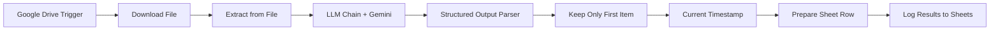

# AI Assignment Detector (n8n Workflow)


Automated n8n workflow that scans student PDF assignments uploaded to Google Drive, uses **Google Gemini 2.0 Flash** to detect AI-generated content with high accuracy, and logs results to Google Sheets.

---

## 🚀 Features

- ✅ **Automated PDF Monitoring** – Watches a Google Drive folder for new/updated PDFs
- ✅ **Text Extraction** – Extracts and joins all pages into a single text block
- ✅ **AI Detection with Gemini 2.5** – Uses a deterministic, evidence-based prompt for consistent scoring
- ✅ **Structured JSON Output** – Validates against a strict schema for reliable parsing
- ✅ **Google Sheets Logging** – Appends one row per assignment with AI score, verdict, confidence, breakdown, and red flags
- ✅ **Stable & Deterministic** – Temperature = 0, single-item enforcement, no retries on success

---

## 📋 Prerequisites

1. **n8n instance** (self-hosted or cloud)
2.  **Google Account** with:
   - Google Drive API enabled
   - Google Sheets API enabled
   - Google AI (Gemini) API key or OAuth2 credentials
3. **Node packages** (if self-hosting):
   - `@n8n/n8n-nodes-langchain`
   - `n8n-nodes-base`

---

## 🛠️ Setup Instructions

### 1. Import the Workflow

1. Download `n8n-ai-detector-workflow.json` from this repo. 
2. In n8n, go to **Workflows** → **Import from File**.
3. Select the JSON file and click **Import**.

### 2. Configure Credentials

You'll need to set up three credentials:

#### A. Google Drive OAuth2
- Node: **New Submission (Google Drive Trigger)** and **Download File**
- Create credential in n8n:
  - Type: `Google Drive OAuth2 API`
  - Follow OAuth flow to authorize your Google account
- Replace `YOUR_GOOGLE_DRIVE_CREDENTIAL_ID` in the JSON or select from dropdown after import. 

#### B. Google Gemini (AI)
- Node: **Google Gemini Chat Model**
- Options:
  - **OAuth2** (recommended): follow n8n's OAuth flow for Google AI
  - **API Key**: get from [Google AI Studio](https://aistudio.google.com/app/apikey)
- Replace `YOUR_GEMINI_CREDENTIAL_ID` in the JSON or select from dropdown. 

#### C. Google Sheets OAuth2
- Node: **Log Results (Google Sheets)**
- Create credential:
  - Type: `Google Sheets OAuth2 API`
  - Authorize the same Google account that owns the target spreadsheet
- Replace `YOUR_GOOGLE_SHEETS_CREDENTIAL_ID` in the JSON or select from dropdown.

### 3. Set Google Drive Folder

1. Open the **New Submission (Google Drive Trigger)** node. 
2. Set **Folder to Watch** to the folder ID where students upload PDFs.
   - To get the folder ID: open the folder in Drive, copy the ID from the URL:
     ```
     https://drive.google.com/drive/folders/FOLDER_ID_HERE
     ```

### 4. Create & Configure Google Sheet

1. Create a new Google Sheet (or use an existing one).
2. Add a header row (Row 1) with these exact column names:

   ```
   date | file_name | ai_score | verdict | confidence | recommendation | indicators | human_elements | human_elements_count | ai_signatures | ai_signatures_count | linguistic_score | content_score | structural_score | signature_score | red_flags | text_preview
   ```

3. Share the sheet with **Editor** access to:
   - Your OAuth2 Google account, OR
   - Your service account email (if using service account credentials)

4. In the **Log Results (Google Sheets)** node:
   - Set **Document** to your Spreadsheet ID (from the URL):
     ```
     https://docs.google.com/spreadsheets/d/SPREADSHEET_ID_HERE/edit
     ```
   - Set **Sheet** to the tab name (e.g., `Sheet1`)

### 5.  Activate the Workflow

1. Click **Active** toggle in the top-right corner of the workflow editor.
2. The trigger will now poll Google Drive every minute for new or updated PDFs.

---

## 🔄 Workflow Overview



### Node Breakdown

| Node | Purpose |
|------|---------|
| **New Submission (Google Drive Trigger)** | Monitors a folder; triggers on new/updated PDFs |
| **Download File** | Downloads the PDF binary |
| **Extract from File** | Extracts text from all pages (joined) |
| **Basic LLM Chain** | Sends text + system prompt to Gemini |
| **Google Gemini Chat Model** | AI model (gemini-2.0-flash-exp, temp=0) |
| **Structured Output Parser** | Validates JSON response against schema |
| **Keep Only First Item** | Ensures exactly one item flows forward (prevents duplicates) |
| **Current Timestamp** | Adds submission timestamp |
| **Prepare Sheet Row** | Normalizes fields, flattens arrays, adds filename |
| **Log Results (Google Sheets)** | Appends one row to the sheet |

---

## 📊 Output Schema

Each row logged to Google Sheets contains:

| Column | Type | Description |
|--------|------|-------------|
| `date` | string | Submission timestamp (MM/DD/YYYY HH:mm:ss) |
| `file_name` | string | Original PDF filename |
| `ai_score` | integer (0–100) | Overall AI likelihood score |
| `verdict` | string | Human \| Likely Human \| Mixed \| Likely AI \| AI-Generated |
| `confidence` | string | Low \| Medium \| High |
| `recommendation` | string | APPROVE \| REVIEW \| FLAG |
| `indicators` | string | Key observations (pipe-separated) |
| `human_elements` | string | Human markers found (or "None") |
| `human_elements_count` | integer | Count of human elements |
| `ai_signatures` | string | AI patterns detected (or "None") |
| `ai_signatures_count` | integer | Count of AI signatures |
| `linguistic_score` | integer (0–100) | Linguistic dimension score |
| `content_score` | integer (0–100) | Content dimension score |
| `structural_score` | integer (0–100) | Structural dimension score |
| `signature_score` | integer (0–100) | AI signature dimension score |
| `red_flags` | string | Critical concerns (or "None") |
| `text_preview` | string | First 200 characters of assignment |

---

## 🧠 AI Detection Methodology

The workflow uses a **deterministic, evidence-based prompt** designed for consistency and transparency. 

### Evaluation Dimensions

1. **Linguistic Patterns (30%)**
   - Sentence variety, flow, vocabulary naturalness, filler words, repetitive LLM phrases

2. **Content Characteristics (25%)**
   - Personal insight, specific examples, authentic voice, originality

3. **Structural Anomalies (20%)**
   - Paragraph uniformity, mechanical transitions, lack of organic development

4. **AI Signatures (15%)**
   - Stock phrases ("delve into", "in conclusion"), excessive hedging, perfect grammar

5. **Human Markers (10%)**
   - Grammatical slips, personal anecdotes, emotional nuance, domain-specific terminology

### Scoring Bands

- **0–20**: Definitely Human
- **21–40**: Likely Human
- **41–60**: Mixed / Uncertain
- **61–80**: Likely AI
- **81–100**: Definitely AI-Generated

### Recommendation Logic

- **APPROVE**: ai_score ≤ 40
- **REVIEW**: 41–60 OR confidence = Low
- **FLAG**: ai_score ≥ 61

---

## ⚙️ Configuration & Tuning

### Model Settings (Google Gemini Chat Model node)

- **Model**: `gemini-2.0-flash-exp` (or `gemini-1.5-flash`)
- **Temperature**: `0` (deterministic; same input → same output)
- **Top P**: `1`
- **Top K**: `40`
- **Max Output Tokens**: `2048`

### Structured Output Parser

- **Schema Type**: Define using JSON Schema
- **Auto-Fix Format**: OFF (recommended after testing; prevents retries)
- **JSON Schema**: See `n8n-ai-detector-workflow.json` for the full schema

### System Prompt

The system prompt is embedded in the workflow.  Key features:
- Strict JSON-only output (no markdown, no commentary)
- Evidence-based indicators (must cite text snippets)
- human_elements never empty (uses `["None"]` if none found)
- Integer-only scores for consistency

To customize detection sensitivity:
1. Open the **Basic LLM Chain** node
2. Edit the **Chat Messages (System)** field
3. Adjust weights, add/remove phrases, or change scoring bands

---

## 🧪 Testing

### Manual Test

1. Upload a sample PDF to your monitored Google Drive folder. 
2. Wait ~1 minute (trigger poll interval).
3. Check the workflow execution in n8n (Executions tab).
4. Verify a new row appears in your Google Sheet.

### Sample PDFs for Testing

- **Human-written**: Personal essays with anecdotes, informal language, minor typos
- **AI-generated**: ChatGPT/Gemini-written assignments with stock phrases, perfect structure, generic content

### Expected Behavior

- **Human text**: ai_score 15–35, verdict "Human" or "Likely Human", recommendation "APPROVE"
- **AI text**: ai_score 70–95, verdict "Likely AI" or "AI-Generated", recommendation "FLAG"
- **Mixed/edited**: ai_score 40–60, verdict "Mixed", recommendation "REVIEW"

---

## 🐛 Troubleshooting

### Issue: "Error fetching options from Google Sheets"
**Cause**: Credential or permission issue. 
**Fix**:
- Ensure the sheet is shared (Editor access) with your OAuth account or service account email. 
- Use Spreadsheet **ID** instead of URL in the Sheets node. 
- Re-authenticate the Google Sheets credential.

### Issue: Multiple rows logged for one PDF
**Cause**: Multiple items flowing into Sheets node.
**Fix**:
- Confirm **Keep Only First Item** node is connected and active.
- Turn OFF **Auto-Fix Format** in Structured Output Parser (after testing).
- Check Extract from File has **Join pages** enabled.

### Issue: ai_score always 0 or null
**Cause**: Parsed JSON structure mismatch.
**Fix**:
- Open **Prepare Sheet Row** (Code node) > Execution > Input tab.
- Confirm `ai_score` exists in the JSON.
- If not, the LLM didn't return valid JSON; check the **Basic LLM Chain** output and system prompt.

### Issue: Inconsistent scores for the same PDF
**Cause**: Non-deterministic model settings.
**Fix**:
- Set **Temperature** to `0` in the Gemini model node.
- Ensure **Top P** = `1` and **Top K** = `40`. 
- Confirm the system prompt includes strict scoring rules.

### Issue: Workflow doesn't trigger
**Cause**: Trigger configuration or permissions.
**Fix**:
- Verify **Folder to Watch** ID is correct.
- Ensure the workflow is **Active** (toggle on). 
- Check Google Drive credential has access to the folder. 
- Test manually by clicking **Execute Workflow** and uploading a PDF.

---

## 📦 Dependencies

### n8n Nodes

- `@n8n/n8n-nodes-langchain` (LLM Chain, Gemini model, output parser)
- `n8n-nodes-base` (Google Drive, Google Sheets, Code, DateTime, Item Lists, Extract from File)

### External APIs

- Google Drive API
- Google Sheets API
- Google AI (Gemini) API

---

## 📄 License

MIT License - see [LICENSE](LICENSE) file for details. 

---

## 🤝 Contributing

Contributions are welcome! Please:

1. Fork the repo
2. Create a feature branch (`git checkout -b feature/my-feature`)
3. Commit your changes (`git commit -m 'Add my feature'`)
4. Push to the branch (`git push origin feature/my-feature`)
5. Open a Pull Request

---

## 📧 Support

For issues or questions:
- Open an issue in this repo
- Tag [@Yasirpyro](https://github.com/Yasirpyro)

---

## 🙏 Acknowledgments

- **n8n** for the powerful workflow automation platform
- **Google Gemini** for the fast, accurate AI model
- The open-source community for LangChain and JSON Schema tooling

---

## 🔗 Links

- [n8n Documentation](https://docs.n8n.io/)
- [Google Gemini API](https://ai.google.dev/)
- [Google Drive API](https://developers.google. com/drive)
- [Google Sheets API](https://developers.google.com/sheets)

---

**Built with ❤️ by [Yasir Shaikh](https://github.com/Yasirpyro)**
